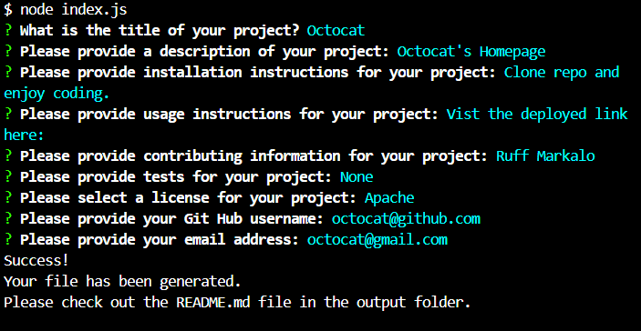
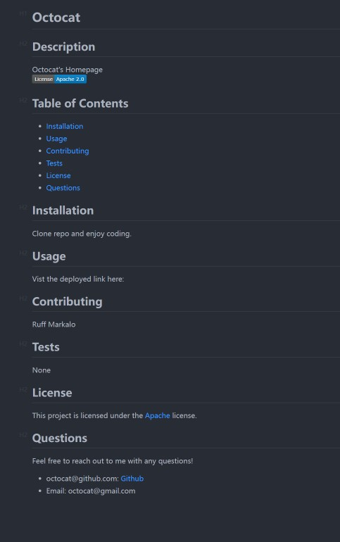

# README.md Generator

## Description

This application uses node.js and inquirer.js to dynamically generate formatted README.md files for use in deploying applications. This application is ran directly from CLI via "node index.js". The user will be prompted in the CLI to enter the fields data pertaining to "Title", "Description", "Installation", "Usage", "Contributing", "Tests", "License", "Github Username", and email address.

This information will then be used to dynamically generate a README.md to be used for applications stored or deployed on Github. Note that if no license is selected there will be no display of license data on the file.  If a license is selected a badge regarding the selected license as well as a license section will be appened to the page with a link to the licensing documentation found on opensource.org or gnu.org. Currently the license information is limited to "MIT", "Apache", and "GPLv3". This can easily be extended to add more licenses.

The finished README will be located in the output folder found in the root directory. If the file is missing or corrupt a new file will be generated automatically. If the application is ran a second time and a good working README is present, the existing one will be overwritten. Make sure to copy the readme to the working directory before re-running the application again to prevent loss of your saved progress.

This application requires "Node.js" installation as well as "inquirer.js" installation.

Node can be installed directly from [https://nodejs.org/en]().

Inquirer.js can be installed once in the root directory via NPM with the CLI command "npm i inquirer" or just simply by using "npm install" [https://www.npmjs.com/package/inquirer]()

This was a project during the Full Stack Web Development Bootcamp at UC Berkeley Ext.

Photo of CLI Prompts:



## Installation

1. Clone repository from repository.
2. Navigate to the root directory of the project using CLI.
3. Install node modules using "npm install"
4. Using the CLI type "node index.js" to start the application
5. Video walkthrough of installation can be found [here](https://drive.google.com/file/d/1uc42Uf1VRRS1AzRkezTrEXJmjrmckzsu/view).  or at URL: https://drive.google.com/file/d/1uc42Uf1VRRS1AzRkezTrEXJmjrmckzsu/view.

## Usage

1. After following the installation guide, type "node index.js".
2. Answer the prompts.
3. Once the final prompt is answered you will get a message indicating if it was successful or not.
4. Look in the folder "output" for the generated README.
5. README.md is not required to be present in the output folder. If the folder is empty a new one will be created.
6. Copy the file to your desired location.

Photo of CLI Prompts:


Photo of output README:



## Code Highlights

Snippet of the use of fs.stat, fs.writeFile, and fs.unlink.

```
function writeReadme(path, data) {
  fs.writeFile(path, data, (error) => {
    if (error) {
      console.error(`Error writing README file: ${error}`)
    } else {
      console.log(
        "Success!\nYour file has been generated.\nPlease check out the README.md file in the output folder."
      );
    }
  })
}
```

## Learning Points

During the development of this project I learned how to use inquirer to generate prompts with Node. As well as the Node built in package "fs" to read and write files directly to specified directories.

## Badges

[](https://developer.mozilla.org/en-US/docs/Web/JavaScript)
[](https://nodejs.org/)
[](https://www.npmjs.com/package/inquirer)
[](https://git-scm.com/)
[](https://github.com/MeanBean87)

## Author / Collaberators

Michael Mattingly

* [GitHub](https://github.com/MeanBean87)
* [LinkedIn](https://www.linkedin.com/in/michael-mattingly-5580b1280/)

This project was created with source code provided from UC Berkeley Extension.

## License

This project is licensed under the [MIT License](./LICENSE). Please refer to the LICENSE file for more details.
